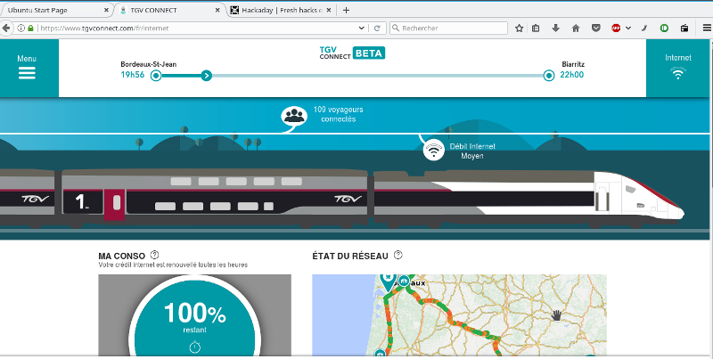

# tgvconnect_gpsd_bridge
a simple gpsd source from onboard french TGV GPS


## Usage

- connect to the ````_tgv_connect```` wifi
- start the bridge by running ````python tgvconnect_gpsd_bridge.py````
- start gpsd as follow ````gpsd -N gpsd://localhost:5006````
- Connect to gpsd with your favorite client such as ````cgps````
